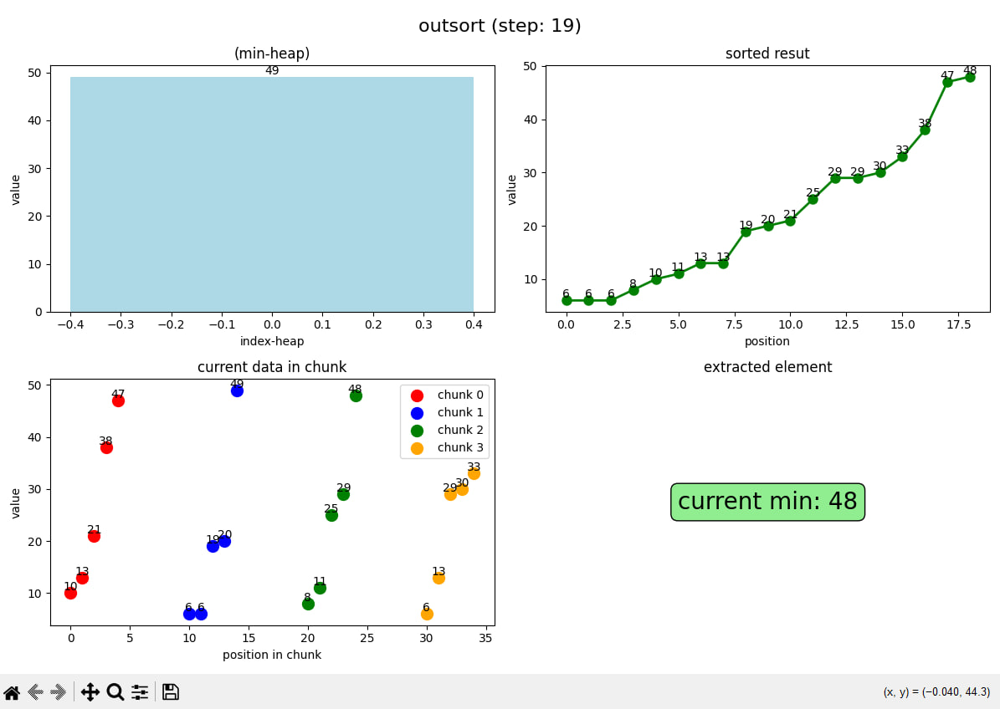
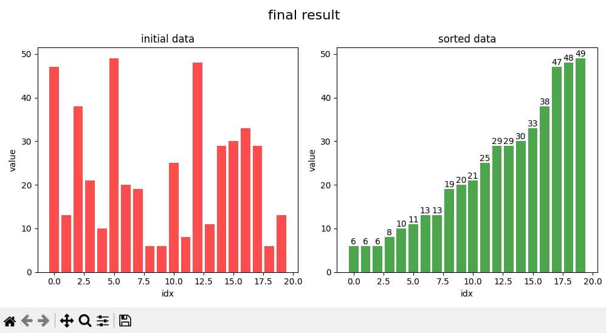
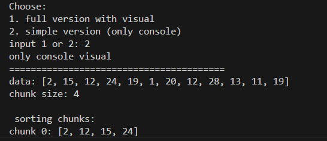

# 🎯 External Sort Visualizer

## 📖 Project Description

The **External Sort Visualizer** is an interactive educational tool designed to demonstrate the external sorting algorithm using a min-heap through comprehensive visualizations. This project serves as a valuable resource for computer science students, educators, and developers seeking to understand sorting algorithms and data structures through practical, visual examples.

### 🎯 Main Features

- **📊 Real-time Visualization** - Watch the sorting process unfold with live graphical representations
- **🎲 Dynamic Data Generation** - Generate random datasets of configurable sizes for varied demonstrations
- **🔢 Dual Operation Modes** - Choose between full graphical interface or lightweight console version
- **📈 Step-by-Step Animation** - Follow each algorithm step with detailed visual explanations
- **🏗️ Min-Heap Operations** - Visualize heap construction and maintenance throughout the process
- **📊 Performance Metrics** - Track algorithm efficiency and step-by-step progress


## 🚀 Installation and Launch

### 🛠️ Requirements

- **Programming Language:** Python 3.8 or higher
- **Package Manager:** pip (Python package installer)
- **Operating Systems:** Windows 10+, macOS 10.14+, or Linux Ubuntu 18.04+

### 📦 Installation Steps

#### 1. Clone the Repository
```bash
git clone https://github.com/sadfyuii/outsorting-method-heaps-chunks-.git
cd outsorting-method-heaps-chunks-
```

## 🛠️ Technical Requirements

### 💻 System Requirements
- **Programming language:** Python 3.8+
- **Operating systems:** Windows 10+, Linux Ubuntu 18.04+, macOS 10.14+

### 📦 Key Dependencies
python
matplotlib >= 3.5.0    # Data visualization and plotting
numpy >= 1.21.0        # Numerical computations and array handling

### 🔧 Technical Stack
💻 **Core Technologies**
Language: **Python 3.8+**

Visualization: **Matplotlib**

Data Processing: **NumPy**

Algorithm: **Custom heap-based external sort**

## 🔄 Algorithm of Operation

### 📋 Step-by-Step Process

1. **🎲 Data Generation** 
   - Creating a random array of numbers for sorting demonstration
   - Configurable array size and value range

2. **📦 Chunking Phase** 
   - Splitting the data into manageable sorted blocks
   - Each chunk is sorted individually using internal sorting
   - Configurable chunk size based on available memory

3. **🏗️ Heap Construction** 
   - Initializing the min-heap with the first elements of each chunk
   - Creating a priority queue for efficient minimum element extraction
   - Maintaining chunk references for sequential element access

4. **🔄 Merging Phase** 
   - Sequentially extracting the minimum elements from the heap
   - Adding extracted elements to the resulting sorted array
   - Replenishing the heap with next elements from respective chunks
   - Continuing until all chunks are fully processed

### 🎯 Algorithm Characteristics
- **⏱️ Time Complexity:** O(n log k) where k is the number of chunks
- **💾 Space Complexity:** O(k) for the heap structure
- **⚖️ Stability:** Maintains relative order of equal elements
- **🚀 Efficiency:** Optimal for large datasets that don't fit in memory

### 📊 Algorithm Workflow
  
*Visual representation of the external sorting algorithm workflow showing data chunking, heap construction, and merging phases*

### 📈 Final Results
  
*Comparison between initial unsorted data and final sorted output demonstrating algorithm effectiveness*

### 💻 Console Version
  
*Command-line interface demonstration showing step-by-step sorting process in console mode*

## 🔗 Quick Navigation

- **[README.md](README.md)** - Full project documentation and usage guide
- **[Issues.md](Issues.md)** - Bug reporting guidelines and feedback forms
- **[LICENSEmd](LICENSEmd)** - License terms and usage rights
- **[outsort.py](outsort.py)** - Main application source code
- **[Discussions.md](Discussions.md)** - Discussions


## 👤 Authors

### 🎓 Project Lead & Developer
**Grinev Makar Dmitrievich**  
📧 Email: [pmdworking@yandex.ru](mailto:pmdworking@yandex.ru)  
🎯 Roles: 
- 🧠 Algorithm Developer
- 🏗️ Project Architect  
- 📊 Visualization Developer
- 📝 Technical Writer
- 🧪 Tester

## 📞 Feedback

### 🔧 Support Channels
- **📧 Email:** [feedback@external-sort.com](mailto:feedback@external-sort.com)
- **🐛 Bugs and Suggestions:** [GitHub Issues](/Issues.md)
- **💬 Discussions:** [GitHub Discussions](/Discussions.md)

## 📄 License
This project is licensed under the MIT License - see the [GitHub LICENSE](/LICENSE.md) file for details.


<div align="center">
Built with ❤️ for the developer and student community
</div> 

